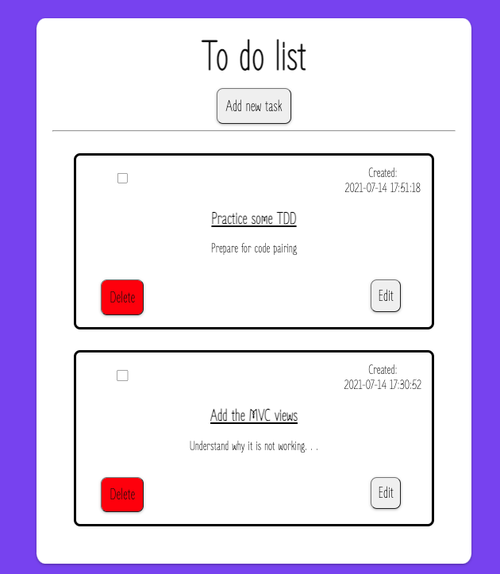
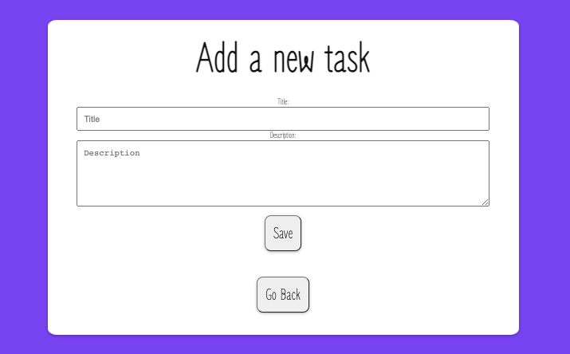
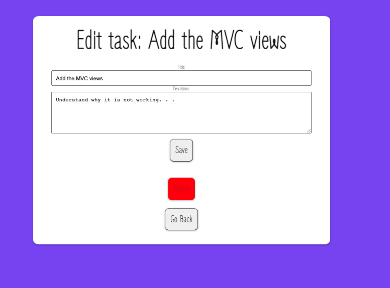

# Todo App

Simple to do app with PHP, MySQL, HTML, CSS and JavaScript.

## Views

1. A view showing all to-do items
   
2. A view in which it's possible to add a to-do item
   
3. A view that allows to edit a to do item.
   

## Setup

Clone repo on a server running PHP e.g XAMPP

Start PHP on [localhost:8080](http://localhost:8080/public/index.php)

```
php -S localhost:8080
```

## Currently Working on:

- [] Move the delete button to the edit page
- [] Change to MVC views
- [] Have all errorMsgs with Ajax (JavaScript)
- [] Refactor and clean up the code
- [] Fix the styling
- [] Save the status/checkbox to the database
